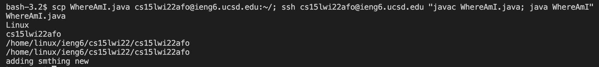

# Lab Report 1
Hello, incoming CSE 15L student (or future me)! <br/>
My name is Stephanie and I will be in charge of getting your course specific account on **ieng6** - the UCSD server that you, as a CSE student, have access to - set up. My credentials are that I myself have successfully been through this process... less than a week ago... and I did encounter ~~several~~ a higher-than-average number of obstacles along the way, but hopefully that will be sufficient. 

Here is an outline of the steps detailed on this page:
1. [Installing VScode](#step-1)
2. [Remotely Connecting](#step-2)
3. [Trying Some Commands](#step-3)
4. [Moving Files with scp](#step-4)
5. [Setting an SSH Key](#step-5)
6. [Optimizing Remote Running](#step-6)

Now, let's get you ready for this class!

## <a name="step-1"></a> Installing VScode 
**Disclaimer**: VScode is the IDE the professor will be using in this class, so downloading it would make lectures and tutorials easier to follow, but you *can* use another IDE. Getting VScode is still highly recommended!

Just like any other other app, installing VScode just takes a quick Google search. In fact, because it has the sweet quality of being *free*, we don't even need to pirate it. 
Going to **[this](https://code.visualstudio.com/download)** link should take you to a page with the following screen. 


From here, download the file that corresponds with your operating system and click the buttons any system pop-ups ask you to click. With that, VScode should be installed (if not please contact your professor or TA).<br/>
The coming steps will mostly be done using the VScode terminal, so, to set that up, open up VScode. Doing so should take you to a screen similar to this:


On MacOS, you can access the terminal with ctrl + upArrow + ` or by going to the app's menu bar and clicking ```New Terminal```.


If you have an operating system that is not MacOs -> professor or TA ;D

## <a name="step-2"></a> Remotely Connecting
Part 1 of step 2, **Remotely Connecting**, will be the only part of the remainder of this tutorial not in VScode. Before remotely connecting to **ieng6**, you will need to set up your course-specific account. 

You can go to **[this](https://sdacs.ucsd.edu/~icc/index.php)** link to get that done. This was the step I personally had the most difficulty with, so I will try to give some tips. 
- Get this step done before class, because everyone trying to sign into the acccount lookup at the same time is hard on the server
- The password requirements are as follows:
    - Be different from any previous passwords
    - Be at least 12 characters long
    - Include characters from at least 3 of the following 4 categories: uppercase, lowercase, numbers, symbols
    - Not contain any part of your username<br/>
- If things aren't loading, go to #1; if prolonged, go to #2<br/>
If things aren't functioning correctly, go to #2
    1. Wait
    2. **Contact professor or TA**

Part 2 of step 2 will be establishing the remote connection.
In your terminal, type

> ssh cs15lwi22[y/c]@ieng6.ucsd.edu

after the prompt. **Make sure to replace the ```[y/c]``` with your unique account code**! 

The terminal should respond by asking for your password. When you type in your password (the one you just made for your course-specific account), keep in mind **the terminal won't display what you type** but what you type *will still go through*!

If the following text shows up in your terminal, you're in!


## <a name="step-3"></a> Trying Some Commands
Next you can practice using some terminal commands!

Try typing some of these into both your local and remote computers:<br/>
> **```exit```** - will let you leave the remote server and return to your computer

- ```ls```
- ```cd```
- ```cd -a```
- ```ls <directory>```
- ```cp /home/linux/ieng6/cs15lwi22/public/hello.txt ~/```

You can look up your own terminal commands to test, too! Have fun with it~


## <a name="step-4"></a> Moving Files with scp
Now that you've grown a little more familiar with using terminal, let's figure out how to move local files to the remote computer. For this introduction, the professor has provided the following file to practice with.

```
class WhereAmI {
  public static void main(String[] args) {
    System.out.println(System.getProperty("os.name"));
    System.out.println(System.getProperty("user.name"));
    System.out.println(System.getProperty("user.home"));
    System.out.println(System.getProperty("user.dir"));
  }
}
```

With ```WhereAmI.java``` created, type

> scp WhereAmI.java cs15lwi22[y/c]@ieng6.ucsd.edu:~/

into your terminal. (**Remember to replace the ```[y/c]```**!) If that was successful, the terminal should ask you to enter your password; type in your course-specific account password. If unsuccessful, please do not contact me; contact your professor or TA. :P


To check if file was moved, you can return to the remote computer and ```ls``` to confirm! 

(In fact, while you are on the remote computer, type in 

> mkdir .ssh

to make a directory that will be needed in the next step!)

## <a name="step-5"></a> Setting an SSH Key
Having to type in your password everytime you log in to the remote computer can be time consuming. Wouldn't it be easier not to have to type it in every. single. time...


Introducing, private and public key pairs! :D Setting up an SSH key will allow you to access the remote computer without need for any password. Nifty, right?!

On **your** computer (not the remote computer), type in the following.

> ssh-keygen

Your computer should have generated the key pair and will ask you to...

```
Enter file in which to save the key (some location): [same location they give you]
``` 
To respond, literally just copy and paste in the same location they give you, it works. (It may be useful to save this location somewhere as you will need to reference it later.) <br/>
I actually messed up this next part, but the terminal will ask you to...

```
Enter passphrase (empty for no passphrase): [LEAVE EMPTY]
```

**Save yourself pain by not typing anything in.** It says ```empty for no passphrase```: you do not want to still have to enter a password just to access the access to the remote computer.

Phew, now that the keys have been created, you need to move the public key from your computer to the remote computer.

If you haven't done so already, make a directory called ```.ssh``` on the remote computer to save the key in.

> ssh cs15lwi22[y/c]@ieng6.ucsd.edu

enter password, the last time you will have to do so~

> mkdir .ssh

> exit

Using the knowledge from the last step, you can transfer the public key to ```.ssh``` on the remote computer:

> scp [the some location they gave you earlier].pub cs15lwi22[y/c]@ieng6.ucsd.edu:~/.ssh/authorized_keys

(The location of you public key is the same as the location you entered to make the key + ```.pub```. You can also find the key where the terminal prints...<br/>
```Your public key has been saved in [this location]```)

Once you've done so, try logging onto the remote computer again! If it works smoothly, congrats! If not, see yourself to the timeout corner, then promptly contact your professor or TA. 

## <a name="step-6"></a> Optimizing Remote Running
This tutorial's just about done now! Now you can practice sending code to the remote server and running it more efficiently. Typing in the same terminal command every time you need to run a program may total to a significant sum. Learning terminal tricks and shorthands can trim that total down.

While it is impossible to run commands without typing what you desire to run at least once, you may reuse previously typed commands by clicking the ```upArrow```. Plus, commands can be strung together (so the command will be read and run one by one), if separated by a semi-colon (```;```).<br/>
For example, using these tricks, working with the terminal may look something like this...

- Send file to remote server + log in to remote server + compile java and run program on remote server on the same line 
```
scp WhereAmI.java cs15lwi22[y/o]@ieng6.ucsd.edu:~/; ssh cs15lwi22[y/o]@ieng6.ucsd.edu "javac WhereAmI.java; java WhereAmI"
```

- ```upArrow``` - brings back command that was just run
```
// fills the following into the command prompt
scp WhereAmI.java cs15lwi22[y/o]@ieng6.ucsd.edu:~/; ssh cs15lwi22[y/o]@ieng6.ucsd.edu "javac WhereAmI.java; java WhereAmI"
```
- ```enter``` to run command
- ```upArrow``` and ```enter``` to repeat command

With this, after the repeated command is typed the first time, running that command all of the following times is reduced to **2** keystrokes. 



My tip is the ```alias``` command which basically allows you to create shortcuts for phrases you might commonly type. I, personally, created the alias ```ucs``` for ```ssh cs15lwi22[y/c]@ieng6.ucsd.edu``` by typing the following.

> alias ucs="ssh cs15lwi22[y/c]@ieng6.ucsd.edu"


Have fun with this information and I hope you have an amazing time in CSE 15L!

---
