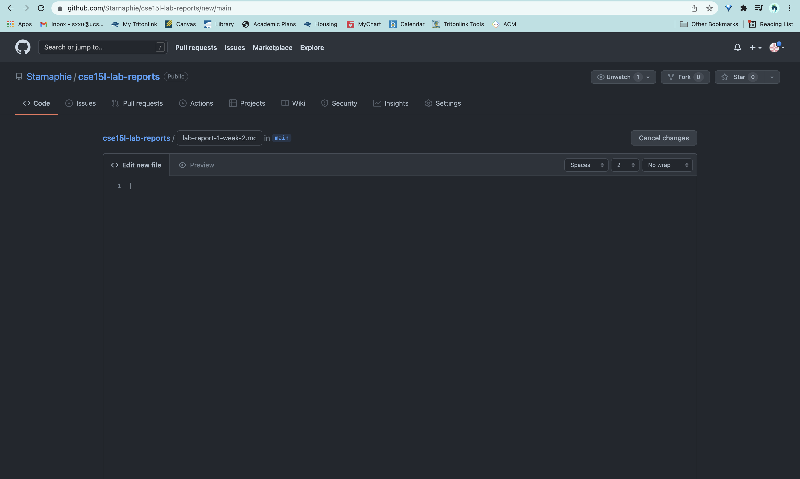

# Lab Report 1
Hello, incoming CSE 15L student (or future me)!  
My name is Stephanie and I will be in charge of getting your course specific account on **ieng6** - the UCSD server that you, as a CSE student, have access to - set up. My credentials are that I myself have successfully been through this process... a week ago... and I did encounter ~~quite a few~~ multiple obstacles along the way, so I pray this will go smoothly for you.  
 
Here is an outline of the steps detailed on this page:
1. [Installing VScode](#step-1) - VScode is the IDE the professor will be using in this class, so it would be beneficial to download it
2. [Remotely Connecting](#step-2) - 
3. [Trying Some Commands](#step-3)
4. [Moving Files with scp](#step-4)
5. [Setting an SSH Key](#step-5)
6. [Optimizing Remote Running](#step-6)

##  Installing VScode 
##  Remotely Connecting
##  Trying Some Commands
##  Moving Files with scp
##  Setting an SSH Key
##  Optimizing Remote Running

