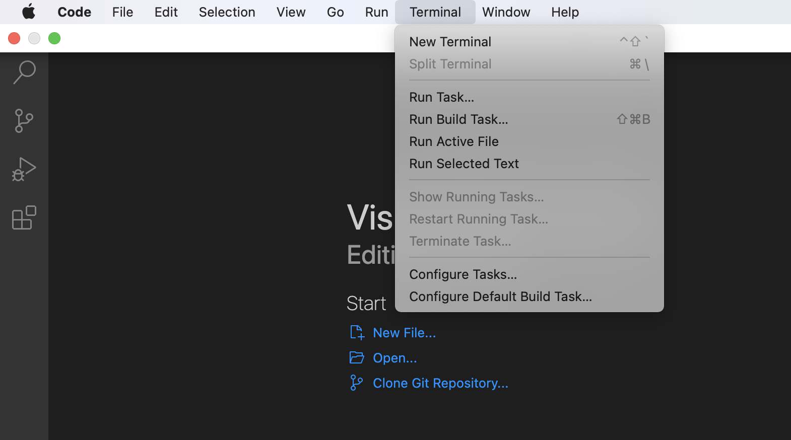

# Lab Report 1
Hello, incoming CSE 15L student (or future me)! <br/>
My name is Stephanie and I will be in charge of getting your course specific account on **ieng6** - the UCSD server that you, as a CSE student, have access to - set up. My credentials are that I myself have successfully been through this process... less than a week ago... and I did encounter ~~several~~ a higher-than-average number of obstacles along the way, but hopefully that will be sufficient. 

Here is an outline of the steps detailed on this page:
1. [Installing VScode](#step-1)
2. [Remotely Connecting](#step-2)
3. [Trying Some Commands](#step-3)
4. [Moving Files with scp](#step-4)
5. [Setting an SSH Key](#step-5)
6. [Optimizing Remote Running](#step-6)

Now, let's get you ready for this class!

## <a name="step-1"></a> Installing VScode 
**Disclaimer**: VScode is the IDE the professor will be using in this class, so downloading it would make lectures and tutorials easier to follow, but you *can* use another IDE. Getting VScode is still highly recommended!

Just like any other other app, installing VScode just takes a quick Google search. In fact, because it has the sweet quality of being *free*, we don't even need to pirate it. 
Going to **[this](https://code.visualstudio.com/download)** link should take you to a page with the following screen. 


From here, download the file that corresponds with your operating system and click the buttons any system pop-ups ask you to click. With that, VScode should be installed (if not please contact your professor or TA).<br/>
The coming steps will mostly be done using the VScode terminal, so, to set that up, open up VScode. Doing so should take you to a screen similar to this:


On MacOS, you can access the terminal with ctrl + upArrow + ` or by going to the app's menu bar and clicking ```New Terminal```.



If you have an operating system that is not MacOs -> professor or TA ;D

## <a name="step-2"></a> Remotely Connecting
Part 1 of step 2, **Remotely Connecting**, will be the only part of the remainder of this tutorial not in VScode. Before remotely connecting to **ieng6**, you will need to set up your course-specific account. 

You can go to **[this](https://sdacs.ucsd.edu/~icc/index.php)** link to get that done. This was the step I personally had the most difficulty with, so I will try to give some tips. 
- Get this step done before class, because everyone trying to sign into the acccount lookup at the same time is hard on the server
- The password requirements are as follows:
    - Be different from any previous passwords
    - Be at least 12 characters long
    - Include characters from at least 3 of the following 4 categories: uppercase, lowercase, numbers, symbols
    - Not contain any part of your username<br/>
- If things aren't loading, go to #1; if prolonged, go to #2<br/>
If things aren't functioning correctly, go to #2
    1. Wait
    2. **Contact professor or TA**

Part 2 of step 2 will be establishing the remote connection.
In your terminal, type

> ssh cs15lwi22[y/c]@ieng6.ucsd.edu

after the prompt. **Make sure to replace the ```[y/c]``` with your unique account code**! 

The terminal should respond by asking for your password. When you type in your password (the one you just made for your course-specific account), keep in mind **the terminal won't display what you type** but what you type *will still go through*!

If the following text shows up in your terminal, you're in!


## <a name="step-3"></a> Trying Some Commands
Next you can practice using some terminal commands!

Try typing some of these into both your local and remote computers:<br/>
> **```exit```** - will let you leave the remote server and return to your computer
- ```ls```
- ```cd```
- ```cd -a```
- ```ls <directory>```
- ```cp /home/linux/ieng6/cs15lwi22/public/hello.txt ~/```

You can look up your own terminal commands to test, too! Have fun with it~


## <a name="step-4"></a> Moving Files with scp
Now that you've grown a little more familiar with using terminal, let's figure out how to move local files to the remote computer. For this introduction, the professor has provided the following file to practice with.

```
class WhereAmI {
  public static void main(String[] args) {
    System.out.println(System.getProperty("os.name"));
    System.out.println(System.getProperty("user.name"));
    System.out.println(System.getProperty("user.home"));
    System.out.println(System.getProperty("user.dir"));
  }
}
```

With ```WhereAmI.java``` created, type

> scp WhereAmI.java cs15lwi22[y/c]@ieng6.ucsd.edu:~/

into your terminal and, if successful, enter in your password.


## <a name="step-5"></a> Setting an SSH Key

## <a name="step-6"></a> Optimizing Remote Running


---
