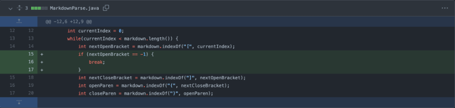
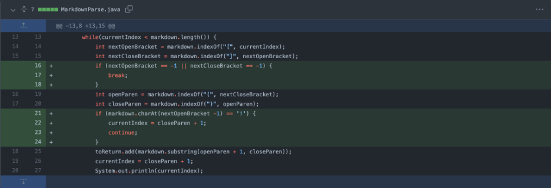
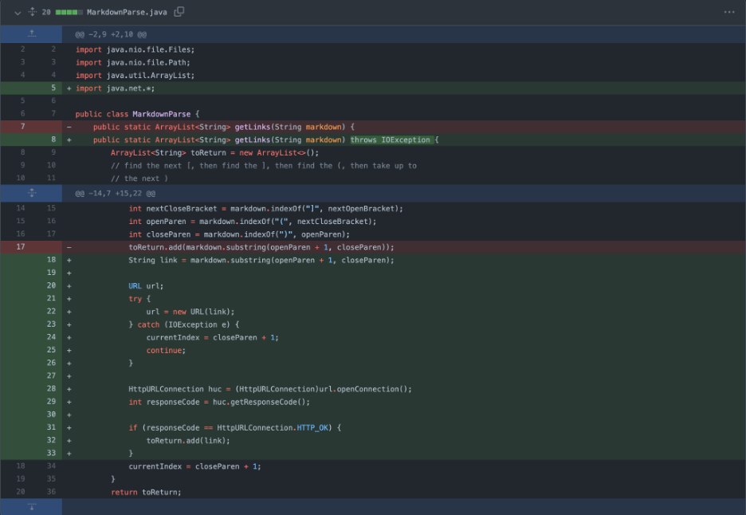

# Lab Report 2
Three changes my group and I made to the ```MarkdownParse.java``` file~<br/>
Each change elaborated on in this post will include the following...
1. the link to the **failure-inducing** input that caused the symptom
2. the faulty output
3. a personal explanation

## Code Change #1
[**Input**](https://github.com/Starnaphie/markdown-parse/blob/main/test-file5.md)

**Output:**
```
stephaniexu@stephanies-mbp markdown-parse % java MarkdownParseOG test-file5.md
Exception in thread "main" java.lang.OutOfMemoryError: Java heap space
        at java.base/java.util.Arrays.copyOf(Arrays.java:3512)
        at java.base/java.util.Arrays.copyOf(Arrays.java:3481)
        at java.base/java.util.ArrayList.grow(ArrayList.java:237)
        at java.base/java.util.ArrayList.grow(ArrayList.java:244)
        at java.base/java.util.ArrayList.add(ArrayList.java:454)
        at java.base/java.util.ArrayList.add(ArrayList.java:467)
        at MarkdownParseOG.getLinks(MarkdownParseOG.java:18)
        at MarkdownParseOG.main(MarkdownParseOG.java:26)
```
The symptom that showed when ```test-file5.md``` was input was that the program ended up in an infinite loop. This was a product of the code's bug in failing to leave the while loop in any case other than if the last character in the ```.md``` file is a close parenthesis (```)```).



## Code Change #2
[**Input**](https://github.com/kate-romero/markdown-parse/blob/main/imageLink.md)

**Output:**
```
[thisisalink.com, thisisanimage, thisisanotherlink.org]
```
The symptom that showed when ```test-file2.md``` was input was that the image links in the markdown were printed. The bug was that the prograam failed to exam if there was an exclamation point(```!```), the indicator of an image, before the first open bracket (```[```).



## Code Change #3
[**Input**](https://github.com/Starnaphie/markdown-parse/blob/main/test-file4.md)

**Output:**
```
[something that is definitely NOT a link :p, https://starnaphie.github.io/cse15l-lab-reports/]
```
The symptom that showed when ```test-file4.md``` was input was that anything in parentheses after a set of brackets was printed, regardless of whether it was a link or not. The bug was that the program didn't confirm if what it was adding to ```toReturn``` was a valid link.

