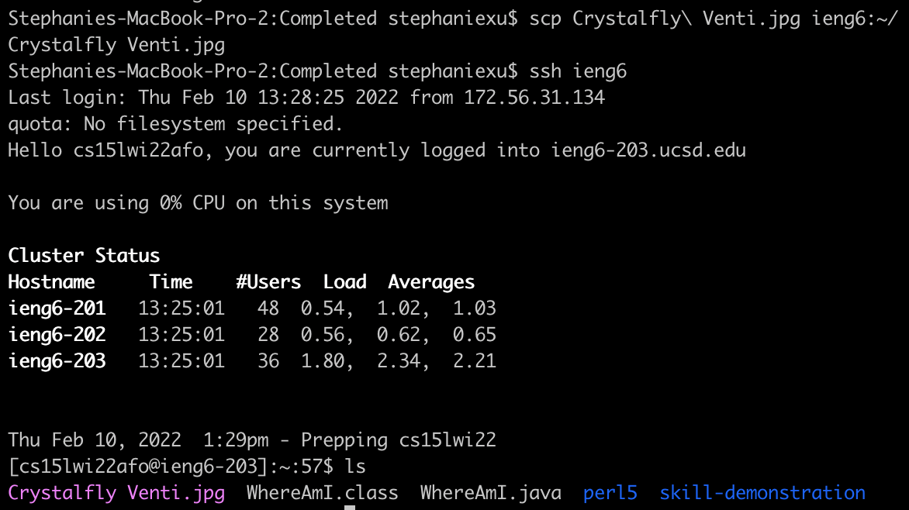

# Lab Report 3
For this third lab report, I will be discussing how to **streamline ssh configuration**.

As you may have noticed already, logging onto ```ieng6``` requires a relatively lengthy aand complex command. And, of course, as computer programmers, that level of inefficiency needs to be fixed. To do so, you can configure your ssh command using the .ssh/config file.

In the .ssh folder (the same one with the key pair you created to access ieng6), create a ```config``` file. Once the file is created, you can use any text editor to add in the following text; I, personally, used ```vim```.

```
Host ieng6 // the shortened command
    HostName ieng6.ucsd.edu
    User cs15lwi22[y/c]
```


With this, you can use the command ```ieng6``` in replacement of ```cs15lwi22[y/c]@ieng6.ucsd.edu```!


