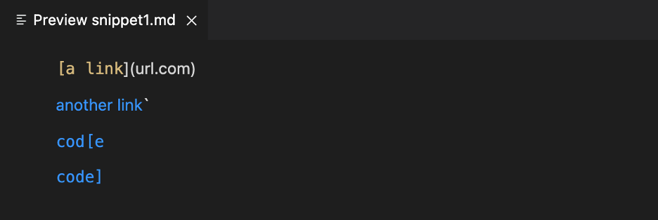
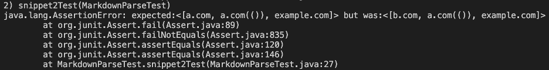

# Lab Report 4
MarkdownParse, U_U the program that now holds a special place in my CSE 15L memory...<br/>
the hours spent sharpening its link-finding skills during lectures and labs enhanced by the thorough reflections we composed regarding our work have all culminated in this lab report<br/>
the result, however, is sadly disappointing. Perhaps writing the perfect link-finding program was not meant for me UnU

1. [Snippet 1](#snippet-1)
2. [Snippet 2](#snippet-2)
3. [Snippet 3](#snippet-3)

Link for [my lab report](https://github.com/Starnaphie/markdown-parse)<br/>
Link for [*other person*'s lab report](https://github.com/atruong39/markdown-parse)

## <a name="snippet-1"></a> Snippet 1
Markdown for Snippet 1:
```
`[a link`](url.com)

[another link](`google.com)`

[`cod[e`](google.com)

[`code]`](ucsd.edu)
```

What Snippet 1 Displays:


Test for Snippet 1:
```
@Test
public void snippet1Test() throws IOException {
    List<String> result = List.of("`google.com", "google.com", "ucsd.edu");
    String contents= Files.readString(Path.of("./snippet1.md"));

    assertEquals(result, [variation of MarkdownParse].getLinks(contents));
}
```

Output of my MarkdownParse:


My program could be changed to work with Snippet 1 relatively easily (by adding some more conditions to the regex), but to ensure backticks as a whole are dealt with properly, it would likely require a longer change. Because of the various ways backticks may be used in the markdown input, using regex to deal with all of the possibilities would be difficult. 

Output of other person's MarkdownParse:


## <a name="snippet-2"></a> Snippet 2
Markdown for Snippet 2:
```
[a [nested link](a.com)](b.com)

[a nested parenthesized url](a.com(()))

[some escaped \[ brackets \]](example.com)
```
What Snippet 2 Displays:


Test for Snippet 2:
```
@Test
public void snippet2Test() throws IOException {
    List<String> result = List.of("a.com", "a.com(())", "example.com");
    String contents= Files.readString(Path.of("./snippet2.md"));

    assertEquals(result, [variation of MarkdownParse].getLinks(contents));
}
```

Output of my MarkdownParse:


In this case, the regex expression in my code likely needs to be supported by other tests. By adding conditions either to the line (before the line is evaluated using regex) or after the supposed link is isolated, the brackets could be fixed. This would likely take more than an easy fix as dealing with all brackets inside bracket cases would require its own algorithm.

Output of other person's MarkdownParse:


## <a name="snippet-3"></a> Snippet 3
Markdown for Snippet 3:
```
[this title text is really long and takes up more than 
one line

and has some line breaks](
    https://www.twitter.com
)

[this title text is really long and takes up more than 
one line](
    https://ucsd-cse15l-w22.github.io/
)


[this link doesn't have a closing parenthesis](github.com

And there's still some more text after that.

[this link doesn't have a closing parenthesis for a while](https://cse.ucsd.edu/


)

And then there's more text
```

What Snippet 3 Displays:


Test for Snippet 3:
```
@Test
public void snippet3Test() throws IOException {
    List<String> result = List.of("https://ucsd-cse15l-w22.github.io/");
    String contents= Files.readString(Path.of("./snippet3.md"));

    assertEquals(result, [variation of MarkdownParse].getLinks(contents));
}
```

Output of my MarkdownParse:


This could likely be fixed relatively easily by revising tokenizing of the markdown file. However, it may take more than 10 lines to refine the tokenizing, perhaps even bringing back more of the previous code's usage indexOf as well. 

Output of other person's MarkdownParse:

