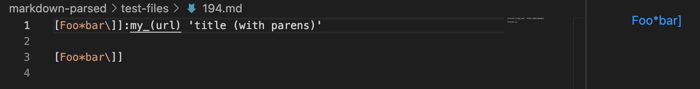
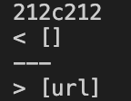
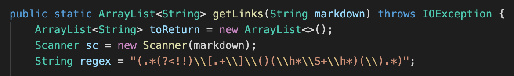
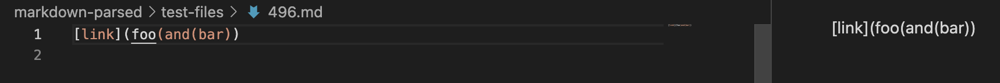
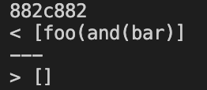
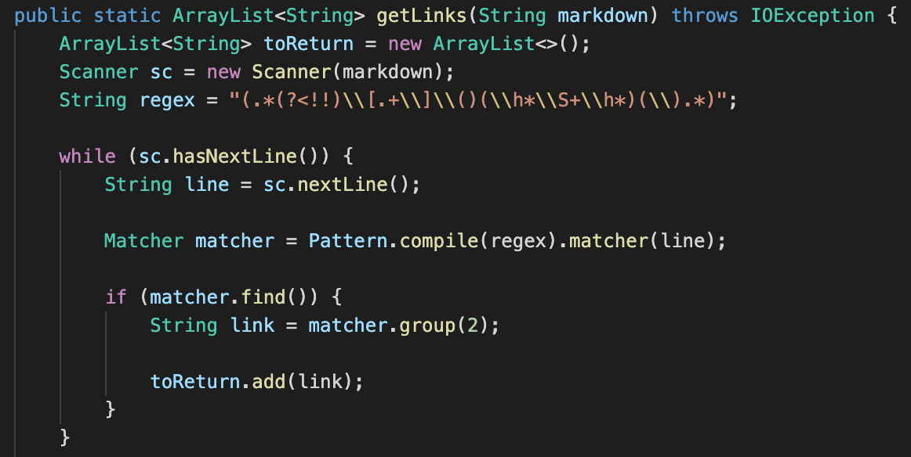

# Lab Report 5
This will be the last lab report entry on this website...<br/>
I attended the last lecture for this course yesterday, signifying the end of this ~~era~~ quarter. CSE 15L was a wonderful experience and I the life lessons I learned here will definitely carry with me far into the future. U^U<br/>

Link for [my markdown-parse](https://github.com/Starnaphie/markdown-parse)<br/>
Link for [the professor's markdown-parse](https://github.com/ucsd-cse15l-w22/markdown-parse)<br/>

I used ```diff``` to find the differences between the results of the tests for the two markdown-parse implementations! I first ran the test files through either of the markdown-parses, creating two ```.txt``` files that each contined the results of all of one markdown-parse's tests. I made sure to add code that indicated which test file correlated with each result. Using ```diff``` on the two files then showed exactly which tests produced varying answers.

## Snippet 1

Anticipated Result:<br/>
```
my_(url)
```


Result from markdown-parses:<br/>
<br/>
(my results, then the other results)

Both of the results are incorrect for this test case. My personal implementation of markdown parse was rather succinct, and upon further reflection, is gravely unqualified for tackling diversity of link cases. As shown below, practically the entire way I approach the problem must be modified. It would likely be smart to revert to the style of markdown parse used by the professor and improve off of that.<br/>


## Snippet 2

Anticipated Result:<br/>
```
[]
```


Result from markdown-parses:<br/>
<br/>
(my results, then the other results)

The result from the professor's markdown-parse was correct. Personally, I am not quite sure why the intended result is what it is, exactly, but I suspect it has something to do with the extra parentheses inside the parentheses for the link. As such, as written for the previous snippet, the style of using a regex expression for markdown parse is likely not feasible. However, going off of what I have, I believe I could get the code to pass this test case by adding an extra method to parse the found links for extra parentheses or brackets.<br/>
